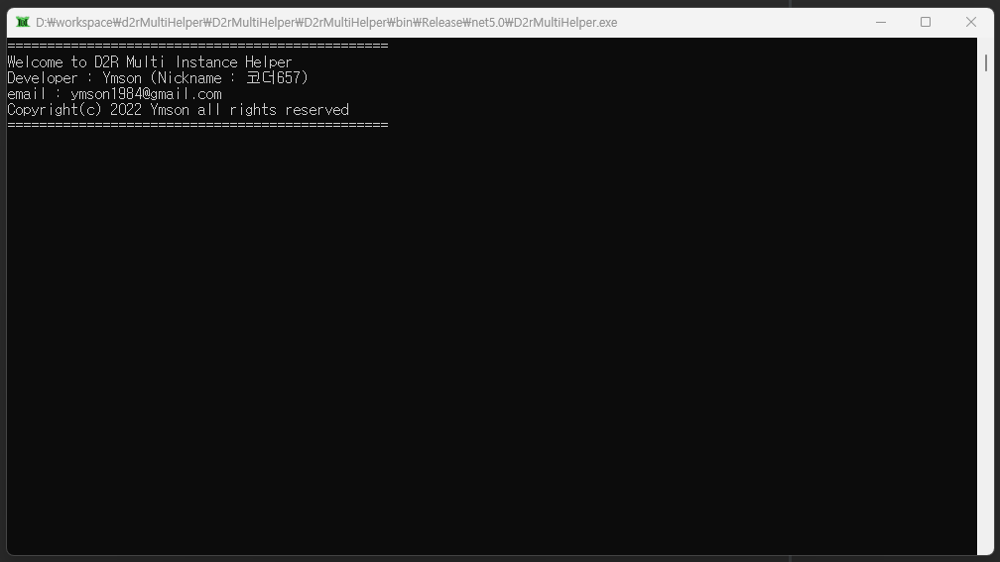
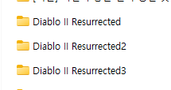
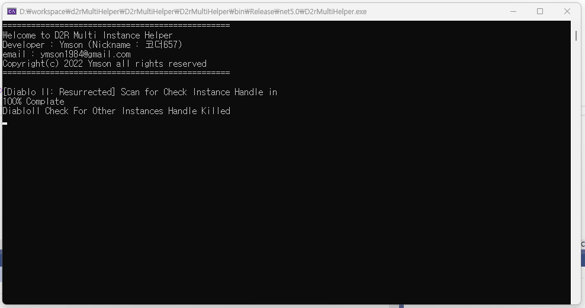
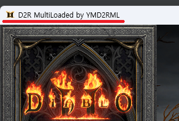

#사용법

1. D2rMultiHelper.exe를 관리자 모드로 실행

   

2. Diablo II Resurrected 폴더를 원하는 동시접속 클라이언트 만큼 복사

   

3. D2R 폴더의 Diablo II Resurrected Launcher.exe를 실행 후 bettle.net에 로그인해서 D2R을 실행한다
4. D2rMultiHelper 콘솔창 확인

   

5. D2R 클라이언트 윈도우 이름이 "D2R MultiLoaded by YMD2RML" 로 변경되어있으면 성공

   

6. 온라인 케릭터 선택 화면까지 진입

   (!!! 필수 - 케릭터 선택 화면까지 진입 하지 않고 다음 클라이언트를 실행하면 배틀넷 로그인이 꼬이는 경우가 있음)

7. 복사해둔 다른 D2R폴더의 Diablo II Resurrected Launcher.exe를 같은 방법으로 3 ~ 6 스탭 반복

### 이 프로그램은 단순하게 각 클라이언트의 인스턴스 체크하는 핸들러를 자동으로 꺼주는 역할만 합니다.
